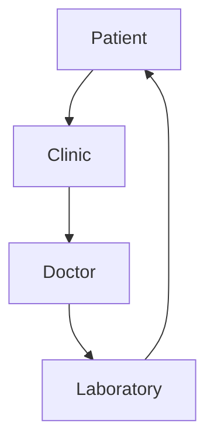

# Documentation Standards

Version: 1.0
Status: Under Review
Last Updated: 2026-07-04
Document ID: DOC-001
Category: Standards
Owner: Software Architecture Team

---

# Purpose

This document defines the documentation standards used throughout the CareLink project.

Its purpose is to ensure that every document follows the same structure, terminology, writing style, and review process.

Consistent documentation improves readability, reduces ambiguity, simplifies onboarding, and helps both human contributors and AI coding assistants understand the project.

Documentation is treated as part of the source code and is considered a critical project asset.

---

# Scope

These standards apply to every document within the `docs` directory.

This includes, but is not limited to:

- Product documentation
- Architecture documentation
- Engineering documentation
- Operations documentation
- Reference documentation
- Architecture Decision Records (ADR)

---

# Audience

This document is intended for:

- Software Architects
- Backend Developers
- Frontend Developers
- Mobile Developers
- UI/UX Designers
- QA Engineers
- DevOps Engineers
- Product Owners
- Medical Advisors
- AI Coding Assistants

---

# Documentation Principles

## Single Responsibility

Each document must answer one primary question.

Examples:

| Document | Responsibility |
|----------|----------------|
| AI_CONTEXT.md | What are we building? |
| BUSINESS_RULES.md | How must the business behave? |
| USER_FLOWS.md | How do users interact with the system? |
| DOMAIN_MODEL.md | What are the business entities? |
| ARCHITECTURE.md | How is the system organized? |

A document should never attempt to cover multiple unrelated topics.

---

## Single Source of Truth

Information should exist in only one authoritative location.

Example:

Appointment booking rules belong only in:

`BUSINESS_RULES.md`

Other documents should reference those rules instead of duplicating them.

---

## Business Before Technology

Business requirements define architecture.

Architecture defines implementation.

Implementation defines infrastructure.

Technology choices must never influence approved business rules.

---

## Technology Independence

Business documentation must never reference implementation technologies.

Correct:

> The system verifies the patient's phone number.

Incorrect:

> NestJS verifies the patient's phone number.

Technology-specific information belongs in engineering documentation.

---

## Consistency

Every document should use:

- Consistent terminology
- Consistent formatting
- Consistent writing style
- Consistent section ordering

Readers should immediately recognize the structure of every document.

---

## Future Friendly

Approved functionality and future ideas must remain separate.

Future functionality belongs under:

```text
Future Considerations
```

Never mix planned features with approved business behavior.

---

# Documentation Structure

The documentation is organized into logical layers.

```text
README
    │
    ▼
Documentation Standards
    │
    ▼
Reference
    │
    ▼
Product
    │
    ▼
Architecture
    │
    ▼
Engineering
    │
    ▼
Operations
```

Each layer depends on the layers above it.

---

# Repository Structure

```text
docs/

product/
architecture/
engineering/
operations/
reference/
templates/
assets/
adr/
```

Each folder has a distinct responsibility.

---

# Required Document Metadata

Every document must begin with the following metadata.

```text
Version
Status
Last Updated
Document ID
Category
Owner
```

---

# Document Status

Allowed values:

- Draft
- Under Review
- Approved
- Deprecated
- Archived

Documents should only be marked as Approved after review.

---

# Versioning

Documentation follows Semantic Versioning.

Examples:

```
1.0
1.1
1.2
2.0
```

### Major

Breaking structural changes.

### Minor

New approved content.

### Patch

Grammar, spelling, formatting, or clarification.

---

# Required Document Structure

Every document should follow this order.

```text
Purpose

Scope

Audience

Related Documents

Main Content

Future Considerations

Document Ownership

Change Log
```

Individual documents may add additional sections when necessary.

---

# Writing Style

Documentation should:

- Use professional language.
- Be concise.
- Use active voice.
- Avoid unnecessary complexity.
- Be objective.
- Be implementation independent where appropriate.

Avoid:

- Marketing language
- Personal opinions
- Ambiguous wording

Prefer:

"The system must..."

instead of

"We think..."

---

# Terminology

Terminology must remain consistent across the project.

Definitions belong exclusively in:

`reference/GLOSSARY.md`

Do not redefine terms in other documents.

---

# Markdown Standards

Use:

- One H1 heading.
- H2 headings for major sections.
- H3 headings for subsections.
- Fenced code blocks with language identifiers.
- Tables for comparisons.
- Bullet lists where appropriate.

Avoid skipping heading levels.

---

# Tables

Use tables whenever they improve readability.

Example:

| Role | Book Appointment |
|------|------------------|
| Patient | Yes |
| Receptionist | Yes |
| Doctor | No |

---

# Diagrams

Use Mermaid whenever possible.

Example:



Large diagrams should be divided into multiple smaller diagrams.

---

# Stable Identifiers

Stable identifiers should never change.

Examples:

Business Rules

```
PAT-001
CLI-001
DOC-001
LAB-001
PHA-001
```

Architecture Decisions

```
ADR-001
ADR-002
```

Events

```
EVT-001
EVT-002
```

API Contracts

```
API-001
```

Database Guidelines

```
DB-001
```

Deleted identifiers must never be reused.

---

# Cross References

Avoid copying information between documents.

Instead, reference the original document.

Example:

See:

`BUSINESS_RULES.md → Appointment Booking`

---

# Change Management

Whenever documentation changes:

1. Update the version if required.
2. Update the change log.
3. Review related documents.
4. Check for contradictions.
5. Maintain terminology consistency.

---

# AI Assistant Guidelines

AI coding assistants should:

- Read documentation before generating code.
- Respect approved business rules.
- Respect documented architecture.
- Avoid inventing workflows.
- Avoid creating duplicate concepts.
- Ask for clarification when documentation is ambiguous.
- Update documentation whenever system behavior changes.

---

# Quality Checklist

Before approving a document verify:

- Grammar is correct.
- Terminology is consistent.
- No duplicated information exists.
- References are valid.
- Tables are readable.
- Diagrams are understandable.
- Future ideas are clearly separated.
- Version and change log are updated.

---

# Future Considerations

Possible future improvements include:

- Documentation website
- Automated documentation validation
- Documentation search
- CI/CD documentation quality checks
- ADR automation

---

# Document Ownership

Owner

Software Architecture Team

Reviewers

- Product Owner
- Lead Software Architect
- Lead Developer
- Medical Advisors
- QA Lead

---

# Related Documents

Previous

- README.md

Next

- reference/GLOSSARY.md

References

- AI_CONTEXT.md
- BUSINESS_RULES.md
- ARCHITECTURE.md

---

# Change Log

| Version | Date | Author | Summary |
|----------|------------|-----------------------------|--------------------------------------------|
| 1.0 | 2026-07-04 | Software Architecture Team | Initial documentation standard |